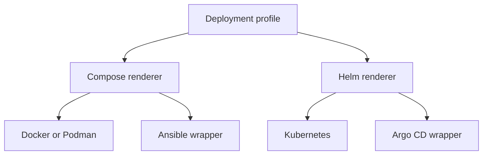

# Architecture

## One profile, two deployment families

Docker and Podman share the pinned `ocis_full` model. Ansible operates that locked output. Kubernetes
uses the pinned chart schema and values. Argo CD operates the same Helm values and must pass continuous
render-equivalence tests.

## Three-part user flow

1. **Prepare your system.** Detect host/cluster state, show installation effects and prepare missing tools.
2. **Configure ownCloud.** Build one target-neutral profile under the hard policy catalogue.
3. **Validate and generate.** Produce readiness, sizing, legal and deployment artifacts.

The browser cannot inspect host executables. It generates a signed Part 1 command; the local bootstrap
returns a redacted readiness report.

## Maturity model

| Maturity | Visible | Runnable | Production claim |
| --- | --- | --- | --- |
| Experimental | No; catalogue metadata only | Never | Never |
| Community Preview | Yes with persistent warning | Evaluation/tested combinations only | No |
| Production | Yes | Yes after all gates | Only with named owner approval |

This implements maturity metadata without weakening the user requirement: experimental oCIS features
remain undeployable even through imports, environment overrides or renderer-specific fields.

## Determinism

The normalized profile, non-secret output and lock are byte-identical for the same inputs. Generated
secrets are stored in a separate secret payload and replaced with stable references in golden tests.
Determinism therefore means **byte-identical modulo generated secret values**.

## Trust boundaries

- Host detection and dry-run are read-only.
- Installation requires explicit approval; non-interactive mutation requires explicit flags.
- Browser values and generated secrets stay local.
- EULA acceptance is local. CLI audit entries may contain local user/host identity but are never sent.
- Unknown maturity, storage drivers or renderer values are denied by default.
