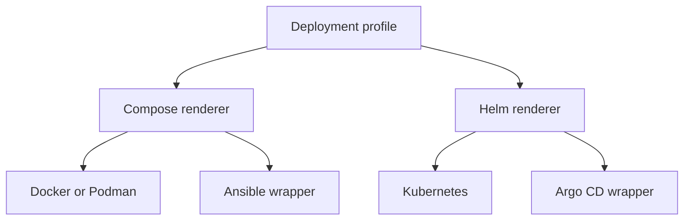

# Architecture

## One profile, two deployment families

Docker and Podman share the pinned `ocis_full` model. Ansible operates that locked output. Kubernetes
uses the pinned chart schema and values. Argo CD operates the same Helm values and must pass continuous
render-equivalence tests.

## Three-part user flow

1. **Prepare your system.** Detect host/cluster state, show installation effects and prepare missing tools.
2. **Configure ownCloud.** Build one target-neutral profile under the hard policy catalogue.
3. **Validate and generate.** Produce readiness, sizing, legal and deployment artifacts.

The browser cannot inspect host executables. It generates a source-locked Part 1 command; attested release
artifacts are a separate launch gate. The local bootstrap
returns a redacted readiness report.

## Maturity model

| Maturity | Visible | Runnable | Production claim |
| --- | --- | --- | --- |
| Experimental | No; catalogue metadata only | Never | Never |
| Community Preview | Yes with persistent warning | Evaluation/tested combinations only | No |
| Production | Yes | Yes after all gates | Only with named owner approval |

This implements maturity metadata without weakening the user requirement: experimental oCIS features
remain undeployable even through imports, environment overrides or renderer-specific fields.

## Determinism

The normalized profile, non-secret output and lock are byte-identical for the same inputs. Generated
secrets are stored in a separate secret payload and replaced with stable references in golden tests.
Determinism therefore means **byte-identical modulo generated secret values**.

## Trust boundaries

- Host detection and dry-run are read-only.
- Installation requires explicit approval; non-interactive mutation requires explicit flags.
- Browser values and generated secrets stay local.
- EULA acceptance is local. CLI audit entries may contain local user/host identity but are never sent.
- Unknown maturity, storage drivers or renderer values are denied by default.

## Conflict Resolution Strategy

When conflicts arise between components, policies, or maintainers:

1. **Version Pin Conflicts**: The pinned version in `catalog/sources.lock.json` is authoritative. Any
   proposed change must include evidence from upstream sources and pass all CI gates. The
   `catalog/compatibility.json` maturity metadata is secondary and must align with the pin.

2. **Policy vs. Profile Conflicts**: The hard policy catalogue (schema, feature flags, maturity gates)
   always takes precedence over user profile inputs. The generator rejects invalid combinations
   with explicit error messages referencing the specific policy violation.

3. **Renderer Discrepancies**: If Docker Compose, Helm, or Ansible wrappers produce different outputs
   for the same profile, the discrepancy is treated as a blocking bug. The CI render-equivalence
   test must pass before any release. The first failing renderer blocks all outputs.

4. **Maintainer Disagreements**: @amamus (interim CODEOWNER) has final decision authority until
   explicit team assignments are accepted. For cross-team conflicts (e.g., brand vs. legal), the
   accountable owner listed in [OWNERSHIP.md](OWNERSHIP.md) or [LAUNCH_GATES.md](LAUNCH_GATES.md)
   has tie-breaking authority within their domain.

5. **Upstream Drift**: When upstream sources (oCIS, chart, Collabora) release new versions,
   automated discovery opens a review issue but **never auto-updates pins**. The maintainer for
   that component must explicitly approve the promotion, and all launch gates must pass.

6. **Security vs. Feature Conflicts**: Security requirements (NFSv4.2 verification, TLS,
   EULA acknowledgement) are non-negotiable. If a feature cannot meet security requirements,
   it is either disabled or removed from the supported matrix.
